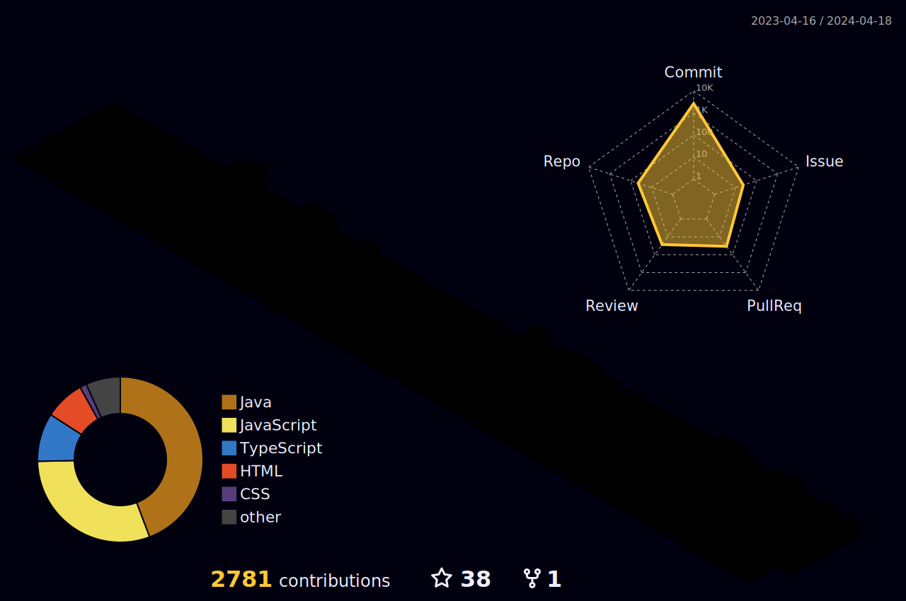

	

	

	
<!-- -->

> <a href="https://u-it.tistory.com">`기술블로그`<a> &nbsp;
> <a href="https://yoohyeok.github.io/u-it">`포트폴리오`<a>

	
## GitHub Stats
<!--  -->

 

<table><tr><td valign="center">
<!--  -->

  </td><td valign="center">
	  

</td></tr></table>  

 
	
## ⚙️ Skill (스킬)
#####  ▫️ Frontend
&nbsp;
&nbsp;
&nbsp;
&nbsp;
&nbsp;

 

#####  ▫️ Backend
&nbsp;
&nbsp;
&nbsp;
&nbsp;
&nbsp;
&nbsp;
&nbsp;
&nbsp;
&nbsp;
&nbsp;
&nbsp;
&nbsp;
&nbsp;
 

#####   ▫️ ViewTemplate
&nbsp;
 

#####  ▫️ DataBase
&nbsp;
&nbsp;
&nbsp;
&nbsp;
 

#####  ▫️ CI / CD
&nbsp;
&nbsp;
&nbsp;
&nbsp;
&nbsp;
&nbsp;
<!-- &nbsp;
&nbsp; -->
 

## 🔭 Career (경력)

> ### 🏢*Diquest* - NLP Solution developer (2024.07.08 ~ ing)
> - #### 카카오 뱅크 챗봇 프로젝트
>   - 인앱 챗봇 빌더 개발
>     - 채널서버와 스킬서버간 봇 빌더 개발 및 구축
>       - RestAPI 기반 자사 `인포채터` 솔루션 연동 모듈 개발
>         - `인포채터` 통신 및 데이터 변환작업 진행
>       - 외부 API(스킬서버) 호출을 위한 `인포채터` ↔ `LAI` 연동 모듈 개발
>         - `인포채터` 통신 및 데이터 변환작업 진행
>   - 카카오 빌더 UI 대응 및 화면 개발
>     - 앱로그 오류 관리도구 RestAPI 및 화면 개발
> - #### 다이버7 솔루션(버전업)
>   - API 인터페이스 파악 및 설계 정의 문서화  
>   - 전체 기능 통합 테스트 진행  
>   - 백엔드 개발 및 JSP 화면 연계
> - #### 디플랫폼2 솔루션
>   - 인사이트 팩토리 F/E 개발
>   - 법률구조공단 F/E 유지보수
>   - 프로토타입 경량화
>   - 2.0.0.0 Release 고도화
>   - GS 인증
> - 기술 스택
>     - SpringBoot, Maven, Mybatis, JPA, Vue.js, Oracle, MySQL

> ### 🏢*Yes E&C* - EHSS Solution developer (2021.11.22 ~ 2022.05.31)
> - #### EHSS 통환 환경 솔루션
>   - 다수 ERP 메뉴 개발 참여
>   - 다수 프로토타입 리뉴얼 참여
> - 기술 스택
>     - SpringBoot, Maven, Mybatis, JSP, Javascript, jQuery&Ajax, AUIGrid, MariaDB
 

## 🗂️ Toy Project (토이 프로젝트)

#### 📱 CoderTown (코끼리 / 맘모스 / 코글)
>
> ##### 간략소개 : 코끼리, 맘모스 - 사이드프로젝트/스터디 구인 & 채팅 서비스 , 코글 - 개발자 커뮤니티
> - 코끼리 : `코`딩하는 사람`끼리`
> - 맘모스 : `맘`맞는사람 `모`여서 `스`터디
> - 코　글 : 코더타운 게시판 커뮤니티
> 
> ##### 📆 기간 : 2023.07 ~ 기획&설계&개발 진행중
>
> ##### 😀 참여자 : <a href="https://github.com/YooHyeok">유재혁<a>
>
> ##### 담당업무 : [백엔드/프론트엔드] 서비스 전체 기획 및 설계, 개발환경 구축
> 
> ##### GitHub - Repository ▶  <a href="https://github.com/YooHyeok/codertown-server">`BackEnd`<a> <a href="https://github.com/YooHyeok/codertown-client">`FrontEnd`<a>
 

## 🗂️ Team Project (팀 프로젝트)

#### 📱 CookCrew (요리일원 - 레시피 공유 플랫폼)
> 
> ##### 간략소개 : 공공 데이터를 활용한 레시피 공유 플랫폼, 등록된 레시피를 활용하여 다이어트 식단표 관리 및 다이어트 챌린지 랭킹 산정
> 
> ##### 📆 기간 : 2022.12.16 ~ 2023.01.07
>
> ##### 😀 참여자 : <a href="https://github.com/YooHyeok">유재혁<a>,<a href="https://github.com/JoHB94">조현빈<a>,<a href="https://github.com/92Lee92">이규희<a>,<a href="https://github.com/mdmdr8">박지혜<a> 
>
> ##### 담당업무 : [기술팀장] 개발환경 구축, 식단관리 외 다수 페이지 구현 /  팀내 오류 해결, 전체 버그수정 및 통합 테스트
>  
> ##### GitHub - Repository ▶  <a href="https://github.com/YooHyeok/cookcrew_backend">`BackEnd`<a> <a href="https://github.com/YooHyeok/cookcrew_frontend">`FrontEnd`<a>

#### 📱 FlowerPot (화분 - 화장품을 분석하다)
>
> ##### 간략소개 : 화장품 성분분석 및 추천, 매거진, 관리자 등으로 이루어진 화장품 쇼핑몰
>
> ##### 📆 기간 : 2020.07.22 ~ 2020.10.14
>
> ##### 😀 참여자 : <a href="https://github.com/yenow">윤신영<a>,<a href="https://github.com/YooHyeok">유재혁<a>,<a href="https://github.com/jamp0824">안준언<a>,<a href="https://github.com/krinu318995">권누리<a>,<a href="https://github.com/aseongen">박성은<a>
>
> ##### 담당업무 : [부팀장] 관리자 API,페이지 및 DB 구축, 팀내 오류 해결
>
> ##### GitHub - Repository ▶  <a href="https://github.com/YooHyeok/flowerPot">`Project`<a>
>
> ##### Prototype Static Page ▶  <a href="https://yoohyeok.github.io/TPFPA">`ProtoType`<a>
 

## 🏆 Honors & Awards(수상 내역)
### 2023년 국가인적자원개발컨소시엄 사업
 - Java기반 Devops 개발자 양성 훈련 과정
 - 🏅최종 프로젝트 경연 (개인 부문) **CoderTown** 최우수상 수상 **(oct 2023)**
 - 수상기관: KOSTA 한국소프트웨어기술진흥협회
### 2022년 광명시 주관 산업분야 맞춤형 인재 양성 사업  
  -  빅데이터 분석 서비스 플랫폼 프론트엔드 개발자 과정
  - 🏅최종 프로젝트 경연(팀 부문) **CookCrew** 최우수상 수상 **(Jan 2023)**
  - 수상기관: KFQ 한국 품질재단
### 2020년 고용노동부 주관 직업훈련 교육과정
  - 프레임워크 기반 자바 웹개발자 양성과정
  - 🏅최종 프로젝트 경연(팀 부문) **FlowerPot** 최우수상 수상 **(Aug 2020)**
  - 수상기관: KG IT BANK
 

## 🪪Certificate (자격증)

> #### SQLD(SQL개발자) 
>
> 📆 취득일 : 2023.07

> #### 정보처리기사 
>
> 📆 취득일 : 2022.11

> #### 사무자동화산업기사 
>
> 📆 취득일 : 2022.08

> #### 컴퓨터활용능력 1급
>
> 📆 취득일 : 2021.08

> #### 정보처리산업기사 
>
> 📆 취득일 : 2021.08

> #### 네트워크관리사 2급
>
> 📆 취득일 : 2021.01

> #### SCA 유럽 바리스타 3급(Foundation)
>
> 📆 취득일 : 2019.10

<!--
**YooHyeok/YooHyeok** is a ✨ _special_ ✨ repository because its `README.md` (this file) appears on your GitHub profile.

Here are some ideas to get you started:

- 🔭 I’m currently working on ...
- 🌱 I’m currently learning ...
- 👯 I’m looking to collaborate on ...
- 🤔 I’m looking for help with ...
- 💬 Ask me about ...
- 📫 How to reach me: ...
- 😄 Pronouns: ...
- ⚡ Fun fact: ...
-->
